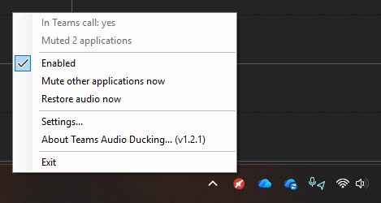
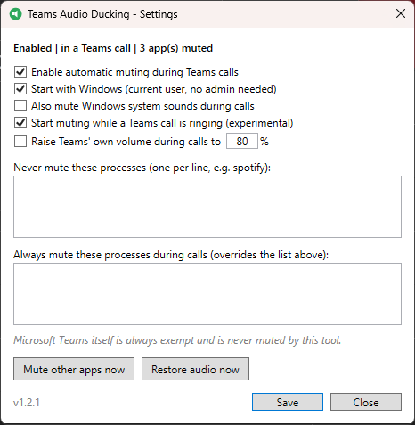

<!-- markdownlint-disable MD033 -->
# Teams Audio Ducking

A small Windows 11 system-tray utility that mutes everything *except*
Microsoft Teams the moment a call starts (or even starts ringing), and puts
every app back exactly as it was when the call ends.

Runs entirely locally: no internet access, no telemetry, no sign-in, nothing
recorded. No admin rights needed.

📝 **Accompanying blog post**: [Mute Apps During Teams Calls Automatically](https://modernworkspacehub.com/mute-apps-during-teams-calls/)
covers the story behind it and a walkthrough.

## The problem it fixes

A Teams call comes in and something is making noise. Spotify, or a YouTube
video buried in one of the 50 Chrome or Edge tabs you have open. Finding the
right tab to mute while the call is ringing costs you a few valuable seconds,
and you answer flustered or mute the whole PC (and with it, the call).

Joining a meeting is the same worry in reverse: are you *sure* everything is
quiet? A forgotten tab, or a paused video that autoplays, will pick the worst
possible moment.

This utility removes the scramble:

- The moment a Teams call rings or connects, **every other app is muted**:
  every tab, every player, on every audio device, including apps you open
  mid-call.
- When the call ends, **each app comes back exactly as it was**: an app that
  was at 35% goes back to 35%, and an app you had muted before the call stays
  muted.
- Teams itself is never muted. Your microphone and default device are never
  touched, and the Windows volume is left alone unless you switch on the
  optional call volume below.

## What you see

It sits in the system tray:

| Icon | Meaning |
| --- | --- |
|  | Enabled, idle: watching for calls |
|  | In a Teams call: other apps muted |
|  | Disabled |

<!-- Screenshot to take: right-click the tray menu DURING a Teams call, so it
     shows "In Teams call: yes" and "Muted N applications" with the red icon
     visible in the tray. Crop tightly to the menu + tray corner. -->

<!-- Screenshot to take: the Settings window as it opens (default state is
     fine). Whole window including title bar with the new icon. -->

Right-click for status, enable/disable, manual mute/restore, Settings and
About (version info). Double-click opens Settings.

## Install

1. Download the latest `TeamsAudioDucking-Setup-x.y.z.exe` from
   [Releases](https://github.com/durrante/TeamsAudioDucking/releases).
2. Run it. No admin prompt: it installs for your user only and adds a
   Start-menu shortcut, with an optional "start at sign-in" tick.

> ⚠️ **Windows SmartScreen may show "Windows protected your PC"** the first
> time you run the setup (or the portable exe). That is expected: the
> installer is not code-signed, so Windows has no reputation data for it.
> Click **More info**, then **Run anyway**. If you would rather not take my
> word for it, the full source is in this repository and you can build it
> yourself.

That's it. The tray icon appears and it starts watching for Teams calls.

Prefer no installer? Grab the portable zip from the same Releases page,
unzip anywhere and run `TeamsAudioDucking.exe`. Startup-with-Windows is
managed from within the app's Settings either way.

### Upgrade

Run the newer setup over the top. Your settings are kept (they live in
`%LOCALAPPDATA%\TeamsAudioDucking`, outside the install folder). The
installer closes the running copy and relaunches it afterwards.

### Uninstall

Windows Settings > Apps > Installed apps > Teams Audio Ducking > Uninstall
(portable copy: exit it from the tray, untick "Start with Windows" first in
Settings, and delete the folder). Settings and logs are deliberately left in
`%LOCALAPPDATA%\TeamsAudioDucking`; delete that folder too for a clean slate.

Building from source needs the [.NET 8 SDK](https://dotnet.microsoft.com/download/dotnet/8.0):
`.\build.ps1` then `.\installer\install.ps1`.

## Settings

- Enable/disable automatic muting
- Start with Windows
- Also mute Windows system sounds (off by default)
- Start muting while a Teams call is ringing (on by default)
- Raise the system volume during calls to a set percentage (off by default):
  for when Windows is turned down and a call arrives. It raises the Windows
  volume of the output device Teams is actually playing through (not
  necessarily your default device), it only ever raises it, and the previous
  level is put back when the call ends. Adjust the volume yourself during the
  call and your level is kept instead
- Never-mute list: processes that are left alone (one per line, e.g. `spotify`)
- Always-mute list: processes muted during calls even if listed above

> "Restore audio now" during a call sticks until the next call: the utility
> will not re-mute behind your back.

## How it knows you're in a call

There is no public local API for the new Teams client's call state, so it
uses two Windows-level signals:

1. **Microphone in use**: Teams holds the mic open for the whole call, even
   while you are muted in Teams. Windows records *which apps have the mic
   open* in the registry (the same bookkeeping behind the taskbar mic icon),
   and that key is watched for changes. Event-driven, no polling.
2. **Ringing**: before a call connects there is no mic activity, so the
   utility looks at how loud Teams' own audio sessions are instead: the
   number behind the moving bar in the Volume Mixer, read five times a second
   while a Teams session is open (and not at all when it is closed). A
   ringtone keeps sounding until you answer, so muting starts about 2.5
   seconds in. A chat ping is audible for about a third of a second, so it
   never adds up to a ring: you would need six pings inside eight seconds to
   fool it. Sessions belonging to Teams' own child processes count too: new
   Teams plays both the incoming-call ringtone and your notification sounds
   through its embedded WebView2 (`msedgewebview2.exe`), which is recognised
   by walking the parent-process chain.

To be clear: the first signal is a yes/no flag Windows already tracks, and
the second is a loudness level, the same one the Volume Mixer draws. Neither
is audio. The utility never opens the microphone, never receives or analyses
any audio from either direction, and has nothing it could record even in
principle.

Worth knowing:

| Scenario | Behaviour |
| --- | --- |
| Mic test in Teams settings, recording a video clip in chat | Counts as a "call": other apps mute until you finish. |
| Joining with **"Don't use audio"**, view-only webinars/live events | Teams never opens the mic, so nothing is detected or muted. |
| Teams in the **browser** (teams.microsoft.com) | Not detected. Add your browser to the never-mute list if you use web Teams alongside the desktop app. |
| Chat pings and other Teams notification sounds | Too short to count as ringing, so nothing is muted. |
| Long sounds played by Teams itself (voice messages, videos in chat) | Sustained Teams playback triggers muting until it stops (untick the ringing option if this bothers you). |
| Windows privacy settings block Teams' mic access | Detection cannot work. |

If ring detection does not fire on your machine, set
`"TraceSessionEvents": true` in `settings.json`, make a short test call, and
the log will show which process plays the ringback so the watch list can be
extended.

## Privacy

Everything runs locally. The utility never connects to the internet, never
reads call contents, audio or credentials, and never records anything. It
reads Windows' own "which app is using the microphone" registry key, reads
the peak level of Teams' own playback (a single number per session, never the
audio itself, and never from the microphone), and controls per-app volume and
mute through the Windows Core Audio API.

## Licence

[MIT](LICENSE): free to use, copy, modify and share, at home or at work.

Provided **as-is, without warranty of any kind**. It is a small tool that
changes per-app audio state; it has been written carefully (exact state
restore, crash recovery), but you use it at your own risk and nobody is
liable if it misbehaves.

## Files it keeps

| Path | Purpose |
| --- | --- |
| `%LOCALAPPDATA%\TeamsAudioDucking\settings.json` | settings |
| `%LOCALAPPDATA%\TeamsAudioDucking\muted-state.json` | crash-recovery state, so audio is restored even if the utility is killed mid-call |
| `%LOCALAPPDATA%\TeamsAudioDucking\logs\TeamsAudioDucking.log` | event log (calls detected, apps muted/restored; 2 MB rotation) |

## Changelog

- **1.4.2**: chat messages and other Teams notifications no longer mute your
  other apps. New Teams plays its pings through the same WebView2 child as
  its ringtone, and Chromium keeps that audio session open (and looking
  "active") for seconds after a sound has finished, so a ping looked exactly
  like a ring. Ring detection now measures how loud Teams actually is rather
  than whether its session is open: it takes roughly 2.5 seconds of real
  sound within an eight-second window, which a ringtone passes and a chat
  ping cannot.
- **1.4.1**: fixes the call-volume option never actually working in the app
  (the log showed "Could not raise the system volume: Specified cast is not
  valid"). The audio device objects are created on the UI thread at startup,
  and Windows will not let the system volume be reached through them from the
  call detector's background thread, so the device is now looked up on
  whichever thread is handling the call.
- **1.4.0**: the call-volume option now raises the **system volume** of the
  device Teams plays through, instead of Teams' own app volume (app volume is
  usually already at 100%, so the old behaviour did nothing on most machines).
  Restored exactly after the call, unless you adjusted it yourself mid-call.
- **1.3.0**: incoming-call ring detection fixed: new Teams plays the incoming
  ringtone through its WebView2 child process, which is now attributed to
  Teams via the parent-process chain (and no longer muted during calls).
  The AVD/Windows 365 media-optimisation client (`MsTeamsVdi.exe`) is now
  recognised as Teams: its calls are detected and it is never muted. The
  call-volume boost logs when Teams is already at or above the target, so a
  no-op is visible in the log instead of silent.
- **1.2.1**: settings window layout fix; README rework with icons and
  screenshots.
- **1.2.0**: optional Teams call-volume boost: raise Teams' own session volume
  to a configurable percentage during calls, restored exactly afterwards
  (never the master volume, never lowered).
- **1.1.0**: muting now starts while a call is ringing (Teams playback
  heuristic, can be disabled in Settings); About menu item with version in
  the tray; proper application icon; `TraceSessionEvents` diagnostic setting.
- **1.0.0**: initial release.
